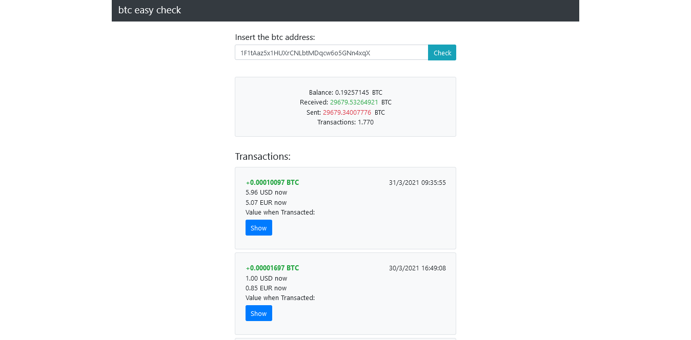

# bitcoin_address_explorer
webpage to explore a bitcoin address via api

### A simple bitcoin address scanner to show only necessary things to check your balance and received transactions.

## It shows the current btc value in USD and EUR for the amount transacted for any transaction and also the value of the amount in EUR and USD when the transaction started (this is the reason why i developed it, no other explorers have such features).

### demo: http://dario91asr.altervista.org/btceasycheck/

